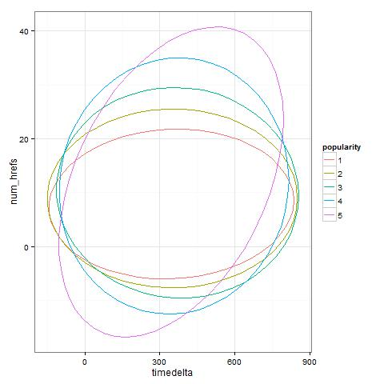
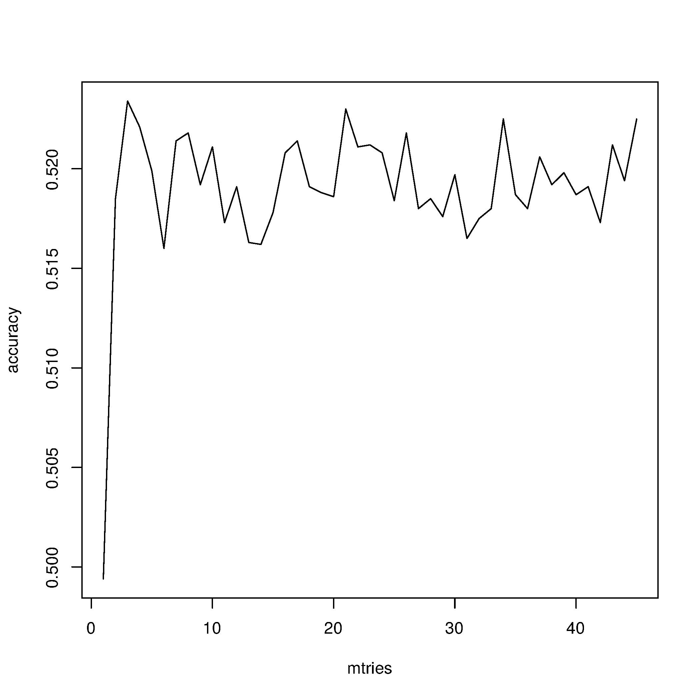

#ABSTRACT
Our final model is a random forest, using the randomForest package. We excluded an outlier observation from the training set and added an interaction term for variables timedelta and num_hrefs. We optimized the following parameters of the function: the number of trees and the number of variables randomly sampled as candidates at each split. We settled for ntree = 400 and mtry = 21.

#INTRODUCTION
We were provided a dataset of online news articles published by Mashable.com with the goal of developing a multi-class classifiers for predicting the level of popularity for each article. The dataset is composed by 60 features and consists of 39,000 articles, of which 30,000 are labeled training data, with the remainder serving as a test set. The popularity is a function of the number of times the article has been shared, where total number of classes is five, where (1) are those that were shared a few times, while (5) being those that went viral. The evaluation critiera is  Classification Accuracy. 

The current report describes the approaches taken by our team, 3-NN, to tackle the competition. The report is organized as follows: In Section 1, we present our exploratory analysis, followed by a description of our efforts to create new features. To conclude, in Section 3, we present our prediction models and results.

#1. EXPLORATORY ANALYSIS

##Outlier detection
To get an initial understanding of the data we looked at boxplots of the variables conditioned on popularity. One variable (id = 22686) has unreasonable values for the variables n_non_stop_words, n_unique_tokens and n_non_stop_unique_tokens. For all other observations the values are between 0 and 1, while for this observation they are over 500 for each of the three. We removed this observation from the training set.

##Principal Component Analysis (PCA)
PCA helped us gain better understanding on the relevance of features, where those closely associated with popularity were average number of key words and news category/topic. For example, there is positive correlation between popularity and the number of average key words and LDA_03 (undiscosed topic). Additionally, low popularity is related with World and Enterntainment news, while mid levels of popularity are associated with Technology-related news. 

```{r, echo=FALSE, warning=FALSE, message=FALSE}
setwd("~/GitHub/Kaggle/news_popularity/kaggle_report")
if (!require("FactoMineR")) install.packages("FactoMineR"); library(FactoMineR)

gbm<-read.csv("VarImpTable_GBM.csv")
rf<-read.csv("VarImpTable_rf.csv")
df3<-read.csv("df2.norm.csv")

popularity<-df3$popularity
gbm_name<-as.vector(gbm[1:25,1]) #variables with weights higher than 10
e<-match(gbm_name, names(df3))
df3<-cbind(df3[,e],popularity)
df3$popularity<-as.factor(df3$popularity)

#remove time and highly correlated variables
nullify <- c("time", "timedelta", "kw_max_avg", "kw_max_min", "kw_min_avg", "n_unique_tokens", "self_reference_min_shares")
df3<-df3[,setdiff(names(df3), nullify)]

#pca
pca<-PCA(df3, quali.sup=ncol(df3),graph=FALSE)

par(mfrow=c(1,2))
plot(pca, choix="var", cex=0.8, select=" contrib 10") #top 10 (threshold chosen stepwise)
plot(pca, habillage=ncol(df3), invisible="ind")
```

##Variable Importance
To cross check our interpretations on variable importance of the PCA above, and to, additionally, understand how variable importance is determined by popular off-the-shelf ensemble methods, we implemented standard Random Forest (RF) and Gradient Boosting Machines (GBM). On one hand, RF decorrelated bagged trees by randomly selecting M predictors from the full set of P predictors for each tree at each iteration, where each tree is independent of the other trees, while on the other, GBM grows low-depth trees sequentially, by using error information obtained from previously grown trees. Results are displayed below, sorted by importance as per RF. Although significantly different, top features are similar with each method and consistent with PCA interpretations. We also notice that the regularization process of GBM is much more strict than that of RF, which suggests RF having higher potential overfitting risk.

```{r, echo=FALSE, warning=FALSE, message=FALSE}
if (!require("lattice")) install.packages("lattice"); library(lattice)

varimp_combined<-merge(gbm, rf, by.x="VariableName", by.y="VariableName")
names(varimp_combined)<-c("VariableName", "GBM", "RF")
varimp_combined<-varimp_combined[order(varimp_combined$RF, decreasing=TRUE),]

#plot
barchart(reorder(VariableName, RF) ~ GBM+RF, data = varimp_combined, 
         stack = TRUE, layout = c(1, 1), xlab="Overall Score",
         scales=list(y=list(draw=FALSE)),
         auto.key = list(title = "Variable Importance Comparison", columns = 2))
```

##Class Imbalance and Positive Skewness
In line with the expectations, the distribution of the popularity of online news article, follows a power law, creating high class imbalance is present in the training data, and can naturally expect the same distribution in the test data. 

```{r, echo=FALSE, warning=FALSE, message=FALSE}
if (!require("knitr")) install.packages("knitr"); library(knitr)

freq<-as.data.frame(table(df3$popularity))
freq<-as.data.frame(t(freq))
names(freq)<-c("Class 1", "Class 2", "Class 3", "Class 4", "Class 5")
freq<-freq[-1,]
kable(freq, format="markdown")
```

In the current competition setup, the cost of Type I/II errors for any class is equal, and therefore we are not concerned with accurately prediction the low frequency of class (4) and (5) articles. Nevertheless, because accurately predicing them could provide a competitive edge, we tried accounting for class in our analysis. Possible strategies include allocating different weights across classes to  increase sensitivity in favor of imbalanced classes, down/up sampling, synthetic minority over-sampling technique (SMOTE), and stratified sampling to equalize the number of obserations across classes. We tried up-sampling and stratified sampling with RF, but were unable to improve over our plain-vanilla RF benchmark.

Related to the class imbalance, we observe that many features presented significant positive skewness.

#2. FEATURE ENGINEERING
To improve algorithmic performance, we applied logarithmic transformations, $log(1+x)$ to the abovementioned skewed features. Additionally, date-related information extracted from the article's URL was discretized (converting all factor levels into dummy variables).  

We extracted from the URL-s the words describing the topic of the article. After stemming, removing stopwords and selecting the most common words, we tried to include them in our model. The randomForest package could not handle well this many features, so we used the ranger package, which is more scalable. We also tried to use hierarchical clusters of the words as features instead of the words themselves. Neither of the above approches improved the accuracy of our prediction.

According to literature, category of the news, language subjectivity, news source, and frequency and relevance of key words (named entities), have been shown to be good predictors for online news popularity (Bandari et al, 2012). Among these four characteristics, all but the news source and relevance of keyword is provided in the original data set. In our context, we defined news source as the author of each article, which was acquired via web scraping. Out of the entire training and test set, we obtained 340 unique authors and 6200 NULL values, suggesting a high ratio of article to unique authors ratio. We ran standard GBM to identify the most important authors, of which only 37 proved to have predicting power. As a proxy for keyword relevance, we attempted to compute a relevance score using data obtained one week prior to each article's publishing date from Google Trend API, but quota limits were too restrictive to complete the queries.

Nevertheless, the addition of these new features did not help improve our standard RF benchmark.

Posteriorly, we added predictions made by K-NN, as new features for RF, but no improvement was observed.

We improved our model with the inclusion of the interaction feature timedelta * num_hrefs. We discovered this feature by looking at bivariate plots where each popularity cluster is represented by an ellipse in which 95% of the observations fall. We plotted these plots for variable pairs where one of the variables was among the most important predictors according to Random Forest. We were looking for plots where the ellipses do not overlap entirely and they are different along a diagonal, not a vertical or horizontal line.



Encouraged by the surprising success of this methodology we have chosen based on these graphs 10 other interaction variables, but including them did not improve the accuracy.

#3. PREDICTION MODELS AND RESULTS
We used random forests as our prediction models, because Ren and Yang wrote that they are the best for this kind of data. We tried gradient boosting machines as well, but they did not perform better.

##Parameter optimization

We tested different number of trees and we decided on ntree = 400, based on the following plot.

[plot needed]

Number of variables randomly sampled as candidates at each split (mtry) does not have a clear effect on accuracy, as the variance is big. But to us there seemed to a slight upward trend, so we chose a value (21) much bigger than the default (8).



##Kaggle submissions

Here we describe the different submissions and their accuracy. We did not make a submission for all the methods we described above, as many times we could see without a submission that it would not be an improvement.

February 7th Basic random forest model with 400 trees.


#BIBLIOGRAPHY
Bandari, R., Asur, S., Huberman, B.A.: The pulse of news in social media: Forecasting popularity. CoRR (2012)

Ren, He, and Yang, Quan.: Predicting and Evaluating the Popularity of Online News. (2015)